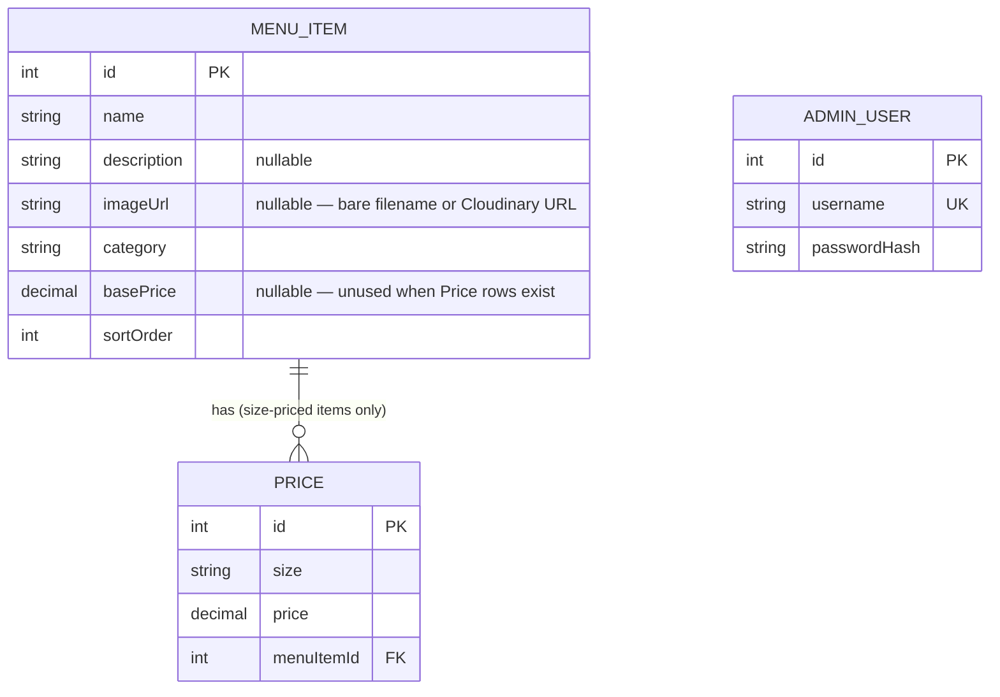

# Square Deli — System Design

*Design Document · Menu &amp; Admin Platform*

> **About this doc.** This describes Square Deli (a restaurant menu site) as its architecture actually stands
> today, written the way a system design doc would read if the whole thing were being proposed fresh right
> now, rather than as the history of how it got here. Shared as a worked example for design-doc practice.

| Status | Owner | Date | Scope |
|---|---|---|---|
| ✅ Live | Placido | 2026-08-10 | Frontend, backend, data, hosting |

## Contents

1. [Summary](#1-summary)
2. [Goals](#2-goals)
3. [Non-goals](#3-non-goals)
4. [System architecture](#4-system-architecture)
5. [Data model](#5-data-model)
6. [API surface](#6-api-surface)
7. [Frontend routes & navigation](#7-frontend-routes--navigation)
8. [Auth & security](#8-auth--security)
9. [Resilience: cold starts & loading states](#9-resilience-cold-starts--loading-states)
10. [Deployment](#10-deployment)
11. [Alternatives considered](#11-alternatives-considered)
12. [Known limitations & future work](#12-known-limitations--future-work)

---

**TL;DR** — A React SPA serves a public two-view menu (sandwiches, everything else) plus a password-gated
admin panel, backed by a small Express API over Postgres. Menu photos live in Cloudinary, not the app. Both
halves deploy independently to Render on every push to `master`, with the free tier's cold-start tradeoff
handled explicitly in the UI rather than ignored.

---

## 1. Summary

Square Deli needs a public menu that's fast and simple to browse on a phone in a restaurant parking lot, and
a private admin panel the owner can use to update prices, descriptions, photos, and item order without
touching code. Those are different enough audiences and different enough risk profiles (public/read-only vs.
private/read-write) that they're built as one frontend app with a clear seam between them, backed by one
small API that enforces that seam server-side, not just in the UI.

## 2. Goals

- The public menu (`/sandwiches`, `/items`) loads correctly on both desktop and mobile, with no dead-ends on
  direct navigation or refresh.
- The admin panel (`/edit`) lets a non-technical owner add, edit, delete, and reorder items — including
  photos — without a code change or a developer.
- Every write to the menu is authenticated server-side; the frontend gate is a UX nicety, not the security
  boundary.
- The whole stack runs for $0/month at this traffic level, accepting the operational tradeoffs that implies
  (see §9) rather than paying to avoid them prematurely.

## 3. Non-goals

- Multi-admin accounts or roles — one owner, one login matches how the business actually runs.
- Online ordering, payments, or reservations — this is a menu display and content-management tool, not a
  transactional storefront.
- A native mobile app — the responsive web app covers the "browsing on a phone" case directly.

## 4. System architecture

```
┌─────────────────────────┐        ┌──────────────────────────┐
│   Render Static Site     │        │     Render Web Service    │
│   React SPA (Vite build) │──HTTP─▶│  Express API (server/)    │
│                           │        │                            │
│  /            Landing     │        │  /api/MenuItems/*          │
│  /sandwiches  MenuSandw…  │        │  /api/auth/login           │
│  /items       MenuDelta   │        └─────────┬──────────┬──────┘
│  /edit        Admin panel │                  │          │
└───────────────────────────┘                  ▼          ▼
                                      ┌──────────────┐ ┌───────────┐
                                      │ Neon Postgres │ │ Cloudinary │
                                      │ (via Prisma)  │ │  (images)  │
                                      └──────────────┘ └───────────┘
```

Two independently deployed services, both on Render, both auto-deploying on push to `master` via Render's
native GitHub integration — no CI pipeline in front of either. The frontend never talks to Postgres or
Cloudinary directly; everything goes through the API, so the DB credentials and Cloudinary keys only ever
exist server-side.

## 5. Data model

One item table, with size-based pricing pulled into its own related table rather than forced onto every row
— most items have one price, sandwiches have Large/Roll pricing, and modeling that as an optional relation
avoids a bunch of nullable columns everywhere else.

```prisma
model MenuItem {
  id          Int      @id @default(autoincrement())
  name        String
  description String?
  imageUrl    String?          // bare filename (legacy) or full Cloudinary URL
  category    String
  basePrice   Decimal? @db.Decimal(10, 2)   // null when priced via Price instead
  prices      Price[]
  sortOrder   Int      @default(0)          // display order within category
  createdAt   DateTime @default(now())
  updatedAt   DateTime @updatedAt
}

model Price {
  id         Int      @id @default(autoincrement())
  size       String                          // "Large" | "Roll"
  price      Decimal  @db.Decimal(10, 2)
  menuItem   MenuItem @relation(fields: [menuItemId], references: [id], onDelete: Cascade)
  menuItemId Int
}

model AdminUser {
  id           Int      @id @default(autoincrement())
  username     String   @unique
  passwordHash String                        // bcrypt — never plaintext
  createdAt    DateTime @default(now())
}
```

`AdminUser` is a single row by design (see §11) — a real table instead of an env var specifically so the
password can be rotated by re-running a script, with no redeploy or config edit involved.

### Entity relationships



Only one real relationship exists in the schema: `MenuItem` → `Price` is one-to-many, optional on the "many"
side. Most items have zero `Price` rows and rely on `basePrice` instead; sandwiches have two (Large, Roll)
today, though nothing in the schema caps it at two — a third size would just work. The foreign key
(`Price.menuItemId`) is required and `onDelete: Cascade`, which is doing real work: it's the entire reason
`DELETE /api/MenuItems/:id` (§6) doesn't need any cleanup logic of its own for a sandwich's prices — the
database guarantees it, not the endpoint.

Two things are deliberately *not* modeled as relationships:

- **`basePrice` vs. `Price` is an either/or in practice, but not in the schema.** Nothing stops a row from
  having both a `basePrice` and `Price` children at once — that's enforced by application code (which field
  the admin form sends), not a database constraint. Worth knowing before extending the pricing model further
  (see §12).
- **`AdminUser` has no foreign key to anything.** No `createdBy`/`updatedBy` on `MenuItem` — every write is
  attributed to "the admin," not a specific account, which is consistent with the single-admin design in §11.
  That would need to change first if multi-admin support ever became a real goal. `username` carries a
  database-level unique constraint, though, so that particular guarantee doesn't depend on application code
  checking first.

## 6. API surface

| Method | Path | Auth | Purpose |
|---|---|---|---|
| `POST` | `/api/auth/login` | — | Exchange credentials for a JWT. |
| `GET` | `/api/MenuItems/sandwiches` | — | Sandwich menu, size-priced items. |
| `GET` | `/api/MenuItems` | — | Flat list of every item. |
| `GET` | `/api/MenuItems/grouped` | — | Items grouped by category key — powers `/items` and `/edit`. |
| `PUT` | `/api/MenuItems/:id` | JWT | Update fields, prices, optional Cloudinary image upload. |
| `POST` | `/api/MenuItems` | JWT | Create a new item. |
| `PUT` | `/api/MenuItems/:id/move` | JWT | Swap `sortOrder` with the adjacent item (up/down reorder). |
| `DELETE` | `/api/MenuItems/:id` | JWT | Delete an item, cascading to its `Price` rows. |

Reads are unauthenticated and cacheable-shaped on purpose — the public menu should never be one bad deploy
away from needing credentials to view. Every write requires a valid JWT, checked server-side regardless of
what the frontend already gated.

## 7. Frontend routes &amp; navigation

| Route | Component | Notes |
|---|---|---|
| `/` | `Landing` | Splash page: View Sandwiches / View Food Items / Login. |
| `/sandwiches` | `MenuSandwiches` (in `Layout`) | Public, size-priced items with photos. |
| `/items` | `MenuDelta` (in `Layout`) | Public, everything else — no photos on mobile (see below). |
| `/edit` | `Edit` | Password-gated admin panel. |

Two navigation patterns run in parallel, deliberately: a `KeyboardToggle` (Space toggles `/sandwiches` ↔
`/items`, `E` jumps to `/edit`) for fast in-store use on a fixed device, and a fixed top-left hamburger button
on mobile (`MenuButtons` on the public pages, a matching `AdminMobileMenu` on `/edit`) limited to the three
destinations a visitor actually needs — not a full site nav, since there isn't one. On `/edit`, the desktop
sidebar's category navigation is dropped entirely below 900px in favor of the category pills already rendered
in the main content, rather than cramming the same nav into two places at once.

`/items` hides its image gallery below 768px and drops the desktop layout's fixed height in favor of normal
page scroll — the original fixed-height 3-column layout was silently clipping content on narrow screens
rather than making it scrollable.

## 8. Auth &amp; security

JWT, not server-side sessions — there's no session store to run for a single admin account, and
revocation-at-scale was never a real requirement here. Login checks the submitted password against a
`bcrypt`-hashed value, using a dummy-hash comparison even for an unrecognized username so "no such user" and
"wrong password" take the same amount of time to reject. The JWT is stored in `localStorage` and sent as
`Authorization: Bearer <token>`; a `401` on any write clears it and forces a re-login rather than failing
silently.

The frontend gating `/edit` behind a login form is UX, not security — the actual boundary is `requireAuth`
middleware on every write endpoint, verified independently of whatever the UI shows.

## 9. Resilience: cold starts &amp; loading states

The backend runs on Render's free tier, which spins down after 15 minutes idle and takes roughly 30-50
seconds to cold-start the next request. That's an accepted tradeoff for $0 hosting at this traffic level (see
§2), but it has a direct UI consequence: a real visitor's *first* request after a quiet period isn't a
network-latency flicker, it's a rendered blank screen for the better part of a minute if nothing accounts for
it.

Every screen that fetches on mount (`MenuSandwiches`, `MenuDelta`, `Edit`) shows a spinner instead of a blank
or stale view while waiting, and that loading state is scoped tightly enough that it doesn't leak into
content that depends on it — page disclaimers, category counts, and nav all wait for the same fetch rather
than rendering ahead of the data they describe.

## 10. Deployment

Both services are Render, both dashboard-configured (no `render.yaml`, no GitHub Actions) rather than
infrastructure-as-code — a deliberate fit for a two-service, single-maintainer project where the dashboard
*is* the source of truth and an extra IaC layer would be overhead without a second engineer to justify it.

- **Frontend** — Static Site, root directory blank, build `npm run build`, publish `dist`.
- **Backend** — Web Service, root directory `server`, build `npm install`, start
  `npm run prisma:deploy && npm start` (applies pending Prisma migrations on every deploy automatically).

One deployment detail worth calling out specifically because it's counter-intuitive: SPA fallback routing
(so a direct browser hit to `/sandwiches` doesn't 404) is handled by a **dashboard-configured Rewrite rule**
(Source `/*` → Destination `/index.html`), not the `public/_redirects` file the repo also carries. That file
is Netlify's convention; Render deploys it as an ordinary static asset but never parses it as a routing rule.
It's kept in the repo anyway — harmless, and other hosts do honor it — but the dashboard rule is what's
actually load-bearing here, and that's the kind of thing worth writing down explicitly rather than leaving
implicit in a dashboard setting nobody documented.

## 11. Alternatives considered

| Decision | Options weighed | Chosen | Why |
|---|---|---|---|
| Database | Neon, Firestore, Supabase, a self-managed VPS+Postgres | **Neon** | Relational shape matches size-based pricing directly; first-class Prisma support; pooled connections out of the box. |
| ORM | Prisma, raw `pg`, Knex | **Prisma** | Schema file doubles as living documentation; typed client catches shape mistakes before runtime. |
| Admin auth | JWT, server sessions, Auth0/Clerk | **JWT** | No session store to run for one account; a third-party provider is overhead this scale doesn't need. |
| Credential storage | DB row, `.env` var | **DB row** | Password rotates by re-running a script — no redeploy, no env-var edit. |
| Image storage | Cloudinary, Firebase Storage, local disk | **Cloudinary** | Local disk doesn't survive a redeploy (ephemeral filesystem); a dedicated image CDN beats storing binaries in the app's own database or repo. |
| Hosting | Render, Railway, Fly.io, a VPS | **Render** | One dashboard for both services; free tier fits current traffic; cold-start tradeoff is explicit and designed around (§9), not hidden. |

## 12. Known limitations &amp; future work

- **Single admin account.** Fine for one owner; would need real roles/permissions before a second person
  needs independent access.
- **`basePrice`/`Price` is an unenforced either/or** (see §5). A malformed request could in principle leave an
  item with both set, and nothing in the schema would catch it — only the frontend forms currently prevent
  that shape from occurring.
- **Free-tier cold starts.** Mitigated in the UI (§9), not eliminated — a paid tier removes it entirely if
  traffic or patience ever demands that.
- **No automated tests.** Acceptable at the current size and change velocity; the first thing that should
  gain coverage if the codebase grows past what manual verification can keep up with is the pricing/shaping
  logic shared between the sandwich and other-items endpoints, since that's the code most likely to silently
  corrupt data rather than visibly crash.
- **No image optimization pipeline beyond Cloudinary's defaults.** Not a current problem, but worth revisiting
  if photo count or traffic grows enough for it to matter.

---

*Square Deli · internal design doc, shared as a practice example.*
