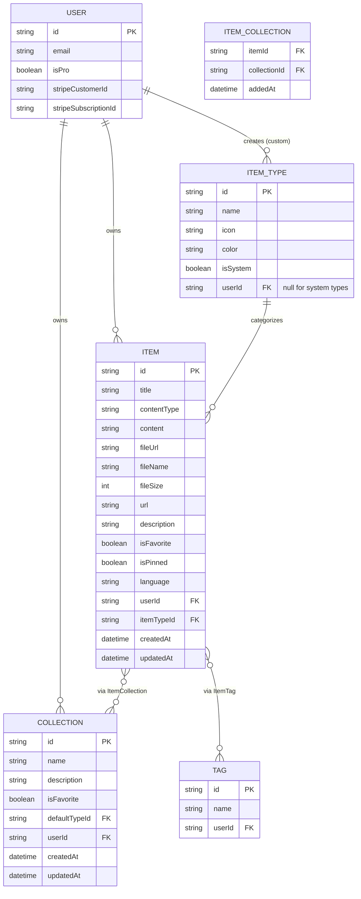
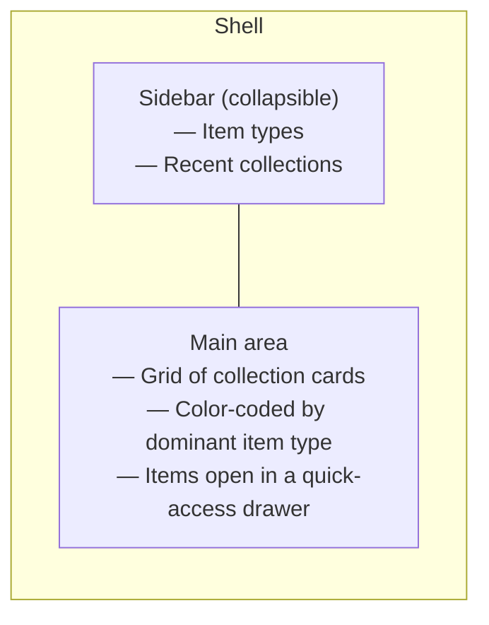
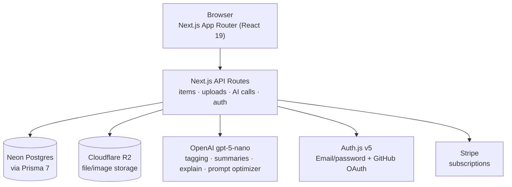

# DevStash — Project Overview

> One fast, searchable, AI-enhanced hub for scattered dev knowledge: snippets, prompts, commands, links, notes, and files.

---

## 1. Problem

Developers spread their working knowledge across too many tools:

- Code snippets → VS Code / Notion
- AI prompts → chat history
- Context files → buried in project folders
- Useful links → browser bookmarks
- Docs → random folders
- Commands → `.txt` files or shell history
- Project templates → GitHub Gists

The result is constant context-switching, knowledge that quietly gets lost, and no consistent workflow for saving or retrieving any of it. **DevStash** consolidates all of it into one place: fast to save to, fast to search, and AI-assisted where it earns its keep.

## 2. Target Users

| User | Core need |
|---|---|
| **Everyday Developer** | Fast capture/retrieval of snippets, prompts, commands, links |
| **AI-first Developer** | A home for prompts, system messages, and reusable contexts |
| **Content Creator / Educator** | Storing code blocks, explanations, and course notes |
| **Full-stack Builder** | Collecting boilerplate, patterns, and API examples |

## 3. Feature Set

### A. Items & Item Types
Every piece of saved knowledge is an **Item** with a **type**. System types ship fixed (users can't edit them, but *can* create custom types later):

| Type | Content kind | Tier |
|---|---|---|
| Snippet | text | Free |
| Prompt | text | Free |
| Note | text | Free |
| Command | text | Free |
| Link | url | Free |
| File | file | Pro |
| Image | file | Pro |

Items are designed to be created in seconds from a global **quick-add drawer** (keyboard-shortcut accessible), not a full-page form.

### B. Collections
- Freeform groupings (e.g. "React Patterns," "Interview Prep," "Context Files")
- **Many-to-many**: one item can live in multiple collections
- Each item shows which collections it belongs to; items can be added/removed from multiple collections at once

### C. Search
Unified search across content, tags, titles, and type — this is the product's spine, not a bolt-on. Worth treating as its own subsystem (see §7, Open Questions).

### D. Authentication
- Email/password
- GitHub OAuth

### E. Core UX Features
- Favorites (items & collections)
- Pin items to top
- Recently used list
- Import code from a file
- Markdown editor for text-type items
- File upload for file/image types
- Export data (multiple formats)
- Dark mode (default), light mode optional
- Multi-collection add/remove from one item

### F. AI Features (Pro)
- Auto-tag suggestions
- Summaries
- "Explain this code"
- Prompt optimizer

## 4. Monetization

| | Free | Pro — $8/mo or $72/yr |
|---|---|---|
| Items | 50 total | Unlimited |
| Collections | 3 | Unlimited |
| System types | All except File/Image | All |
| Custom types | — | Planned (post-launch) |
| Search | Basic | Basic |
| File/Image uploads | ✗ | ✓ |
| AI auto-tagging | ✗ | ✓ |
| AI code explanation | ✗ | ✓ |
| AI prompt optimizer | ✗ | ✓ |
| Export (JSON/ZIP) | ✗ | ✓ |
| Support | — | Priority |

**Dev note:** build the Free/Pro gates now (an `isPro` check + limit constants), but leave every gate open during development so the whole surface area is testable.

## 5. Tech Stack

| Layer | Choice | Notes |
|---|---|---|
| Framework | **Next.js 16**, React 19 | App Router, SSR pages, API routes for backend logic (items, uploads, AI calls) — single repo |
| Language | TypeScript | End-to-end type safety |
| Database | **Neon** (PostgreSQL, serverless) | Cloud Postgres |
| ORM | **Prisma ORM v7** | See §7 — v7 changed migration/generate behavior, plan accordingly |
| Caching | Redis | Maybe — defer until a real cache-miss problem shows up |
| File storage | **Cloudflare R2** | For `file`/`image` type uploads |
| Auth | **NextAuth / Auth.js v5** | Email/password + GitHub OAuth — see §7 for a stability caveat |
| AI | **OpenAI `gpt-5-nano`** | Cheapest GPT-5-class model; good fit for tagging/summarizing at volume |
| Styling | **Tailwind CSS v4** + **shadcn/ui** | |
| Payments | Stripe | `stripeCustomerId` / `stripeSubscriptionId` on User |

**Migration policy:** never `prisma db push` in this project. All schema changes ship as migrations, run in dev, then promoted to prod.

## 6. Data Model

### 6.1 Entity Relationship Diagram



### 6.2 Prisma Schema (draft)

```prisma
// schema.prisma
// datasource / generator blocks omitted — see Prisma 7 notes in §7

model User {
  id                   String       @id @default(cuid())
  name                 String?
  email                String       @unique
  emailVerified        DateTime?
  image                String?
  password             String?      // null if GitHub-only

  isPro                Boolean      @default(false)
  stripeCustomerId     String?      @unique
  stripeSubscriptionId String?      @unique

  items                Item[]
  collections          Collection[]
  itemTypes            ItemType[]
  tags                 Tag[]
  accounts             Account[]
  sessions             Session[]

  createdAt            DateTime     @default(now())
  updatedAt            DateTime     @updatedAt
}

enum ItemContentType {
  TEXT
  FILE
  URL
}

model ItemType {
  id       String  @id @default(cuid())
  name     String  // "snippet" | "prompt" | "note" | "command" | "file" | "image" | "link" | custom
  icon     String  // lucide-react icon name, e.g. "Code"
  color    String  // hex, e.g. "#3b82f6"
  isSystem Boolean @default(false)

  userId   String?
  user     User?   @relation(fields: [userId], references: [id], onDelete: Cascade)

  items    Item[]

  @@unique([userId, name])
}

model Item {
  id          String           @id @default(cuid())
  title       String
  contentType ItemContentType
  content     String?          @db.Text   // snippet/prompt/note/command body
  fileUrl     String?                     // R2 object URL
  fileName    String?
  fileSize    Int?
  url         String?                     // for "link" type
  description String?
  language    String?                     // syntax highlighting hint
  isFavorite  Boolean          @default(false)
  isPinned    Boolean          @default(false)

  userId      String
  user        User             @relation(fields: [userId], references: [id], onDelete: Cascade)

  itemTypeId  String
  itemType    ItemType         @relation(fields: [itemTypeId], references: [id])

  collections ItemCollection[]
  tags        Tag[]            @relation("ItemTags")

  createdAt   DateTime         @default(now())
  updatedAt   DateTime         @updatedAt

  @@index([userId])
  @@index([itemTypeId])
}

model Collection {
  id            String           @id @default(cuid())
  name          String
  description   String?
  isFavorite    Boolean          @default(false)

  defaultTypeId String?
  defaultType   ItemType?        @relation(fields: [defaultTypeId], references: [id])

  userId        String
  user          User             @relation(fields: [userId], references: [id], onDelete: Cascade)

  items         ItemCollection[]

  createdAt     DateTime         @default(now())
  updatedAt     DateTime         @updatedAt

  @@index([userId])
}

model ItemCollection {
  itemId       String
  collectionId String
  addedAt      DateTime   @default(now())

  item         Item       @relation(fields: [itemId], references: [id], onDelete: Cascade)
  collection   Collection @relation(fields: [collectionId], references: [id], onDelete: Cascade)

  @@id([itemId, collectionId])
}

model Tag {
  id     String @id @default(cuid())
  name   String

  userId String
  user   User   @relation(fields: [userId], references: [id], onDelete: Cascade)

  items  Item[] @relation("ItemTags")

  @@unique([userId, name])
}

// --- NextAuth / Auth.js required models ---
model Account {
  id                String  @id @default(cuid())
  userId            String
  type              String
  provider          String
  providerAccountId String
  refresh_token     String? @db.Text
  access_token      String? @db.Text
  expires_at        Int?
  token_type        String?
  scope             String?
  id_token          String? @db.Text
  session_state     String?

  user User @relation(fields: [userId], references: [id], onDelete: Cascade)

  @@unique([provider, providerAccountId])
}

model Session {
  id           String   @id @default(cuid())
  sessionToken String   @unique
  userId       String
  expires      DateTime
  user         User     @relation(fields: [userId], references: [id], onDelete: Cascade)
}
```

**Modeling call-outs (deviations from the rough draft in the notes):**
- `ItemType` and `Tag` are now real relations (`itemTypeId`, `tags Tag[]`) rather than "fields for relations" placeholders, since search and the sidebar both filter by these.
- `contentType` is an enum (`TEXT | FILE | URL`) instead of a free string — matches "text (snippet, note…), url (link), file (file, image)" from the notes, and gives Prisma/TS a closed set to switch on.
- `ItemCollection` uses a composite primary key `[itemId, collectionId]`, which also enforces "no duplicate add" for free.
- Added the two NextAuth v5 tables (`Account`, `Session`) required by the Prisma adapter — not in the original notes but needed for the chosen auth stack to function.

## 7. Open Questions / Recommendations

A few things worth deciding before writing migrations, since they're expensive to change later:

- **Auth.js v5 is still labeled beta** as of mid-2026, and its own maintainers increasingly point new projects toward alternatives like Better Auth for App Router + edge-middleware setups. If GitHub OAuth + email/password is all you need, v5 is fine and matches the notes — just pin an exact version rather than tracking `latest`, and treat a future auth migration as a live possibility.
- **Prisma 7 changed some defaults you'll want to know up front**: `prisma migrate dev` / `db push` no longer auto-run `prisma generate` or auto-seed — both need explicit commands now (`prisma generate`, `prisma db seed`) — and project config has moved toward a `prisma.config.ts` file. Worth setting up your `package.json` scripts around this from day one rather than discovering it mid-migration.
- **AI model choice**: `gpt-5-nano` is live and is the cheapest GPT-5-class model, which fits well for high-volume, low-stakes calls like auto-tagging. A newer `gpt-5.4-nano` also exists with a larger context window at roughly 4x the price — worth a quick benchmark on tagging/summary quality before committing, since nano-tier quality is exactly where that price jump might or might not matter.
- **Redis ("Maybe")**: skip it for the prototype. Add it only once you have a specific slow query or rate-limit need — premature caching adds ops surface for no measured benefit.
- **Custom item types** are marked "later" in Pro, but the schema above already supports them (`userId` nullable on `ItemType`) — no schema rework needed when you turn that feature on.
- **Search implementation** isn't specified. For a Postgres-only MVP, Postgres full-text search (`tsvector` + a GIN index across title/content/tags) is likely enough to launch with; only reach for something like Meilisearch/Typesense if search becomes the bottleneck.

## 8. UI / UX

**General:** modern, minimal, developer-focused. Dark mode by default. Clean type, generous whitespace, subtle borders/shadows. Reference points: Notion, Linear, Raycast. Syntax-highlighted code blocks throughout.

**Layout**



On mobile, the sidebar collapses into a drawer.

**Type colors & icons** (drives card borders, item chips, and sidebar icons):

| Type | Color | Hex | Icon (lucide-react) |
|---|---|---|---|
| Snippet | 🔵 Blue | `#3b82f6` | `Code` |
| Prompt | 🟣 Purple | `#8b5cf6` | `Sparkles` |
| Command | 🟠 Orange | `#f97316` | `Terminal` |
| Note | 🟡 Yellow | `#fde047` | `StickyNote` |
| File | ⚪ Gray | `#6b7280` | `File` |
| Image | 🩷 Pink | `#ec4899` | `Image` |
| Link | 🟢 Emerald | `#10b981` | `Link` |

**Micro-interactions:** smooth transitions, hover states on cards, toast notifications for actions, loading skeletons on data fetch.

### Screenshots

Refer to the screenshots below as a base fpr the dashboard UI. It does not have to be exact. Use it as a reference:

    - @context/screenshots/screenshot-ui-main.png
    - @context/screenshots/screenshot-ui-main-drawer.png


## 9. High-Level Architecture



## 10. Reference Links

- [Next.js docs](https://nextjs.org/docs)
- [Prisma ORM v7 docs](https://www.prisma.io/docs/orm)
- [Prisma v7 upgrade guide](https://www.prisma.io/docs/guides/upgrade-prisma-orm/v7)
- [Auth.js (NextAuth v5)](https://authjs.dev)
- [Neon (serverless Postgres)](https://neon.tech/docs)
- [Cloudflare R2](https://developers.cloudflare.com/r2/)
- [Tailwind CSS v4](https://tailwindcss.com/docs)
- [shadcn/ui](https://ui.shadcn.com)
- [OpenAI GPT-5 nano](https://platform.openai.com/docs/models/gpt-5)
- [lucide-react icons](https://lucide.dev/icons/)
